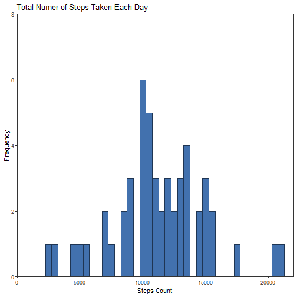
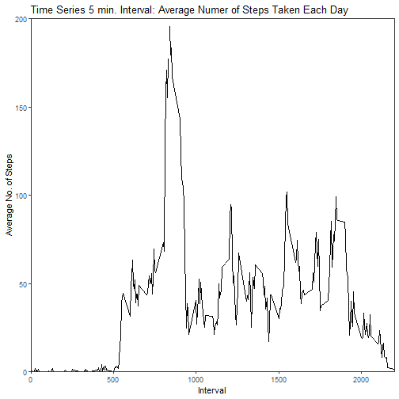
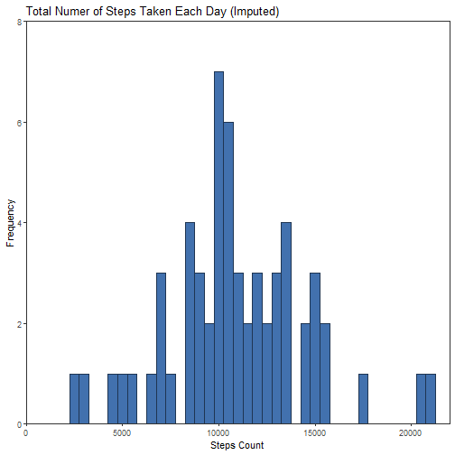
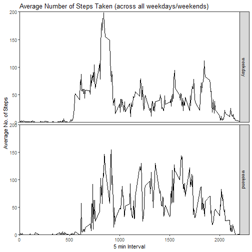

###Reading in the data of a fitness tracker

```r
dat <-  read.csv("C:\\Users\\Lucas\\Downloads\\repdata_data_activity\\activity.csv",na.strings = c("NA","NaN","","#DIV/0!"))
str(dat)
```

```
## 'data.frame':	17568 obs. of  3 variables:
##  $ steps   : int  NA NA NA NA NA NA NA NA NA NA ...
##  $ date    : Factor w/ 61 levels "2012-10-01","2012-10-02",..: 1 1 1 1 1 1 1 1 1 1 ...
##  $ interval: int  0 5 10 15 20 25 30 35 40 45 ...
```

```r
dat$date <- as.Date(dat$date, format = "%Y-%m-%d")
head(dat)
```

Including packages that are used in the project

```r
library(ggplot2)
library(dplyr)
library(mice)
```

### 1. What is the total number of steps taken per day?


Using dplyr, total number of steps is calculated per day using group_by function
Since there are missing values in the dataset, we need to specify na.rm=TRUE

```r
sumdat <- dat %>%
            group_by(date) %>%
            summarize(sumStep=sum(steps),na.rm=TRUE)
total_step <- aggregate(steps ~ date, data = dat, sum, na.rm = TRUE)
str(total_step)
```

```
## 'data.frame':	53 obs. of  2 variables:
##  $ date : Date, format: "2012-10-02" "2012-10-03" ...
##  $ steps: int  126 11352 12116 13294 15420 11015 12811 9900 10304 17382 ...
```

Chunk of the code used to create a plot 

```r
newtheme <- theme_bw() + 
          theme(plot.title = element_text(color = "Black"))

barfill <- "#4271AE"
barlines <- "#1F3552"
```
### 2. Histogram of the total number of steps taken each day?


```r
ggplot(sumdat, aes(x=sumStep)) + 
  ggtitle("Total Numer of Steps Taken Each Day") +
  geom_histogram(aes(y = ..count..), binwidth = 500,
                 colour = barlines, fill = barfill)+
  scale_y_continuous(name="Frequency",limits=c(0,8),expand = c(0,0))+
  scale_x_continuous("Steps Count",limits=c(0,22000),expand=c(0,0))+
  theme_bw()+
  theme(panel.grid = element_blank())
```

```
## Warning: Removed 8 rows containing non-finite values (stat_bin).
```

```
## Warning: Removed 2 rows containing missing values (geom_bar).
```


### 3. Mean and median number of steps taken each day

```r
mean(sumdat$sumStep,na.rm=TRUE)
```

```
## [1] 10766.19
```

```r
median(sumdat$sumStep,na.rm=TRUE)
```

```
## [1] 10765
```

Preparing data to create average number of steps per interval

```r
avgdat <- dat %>%
  group_by(interval) %>%
  summarize(avgStep=mean(steps,na.rm=TRUE))
```

### 4. Time series plot of the average number of steps taken


```r
ggplot(avgdat, aes(x=interval,y=avgStep)) + 
  ggtitle("Time Series 5 min. Interval: Average Numer of Steps Taken Each Day") +
  geom_line()+
  scale_y_continuous(name="Average No. of Steps",limits=c(0,200),expand = c(0,0))+
  scale_x_continuous("Interval",limits=c(0,2200),expand=c(0,0))+
  theme_bw()+
  theme(panel.grid = element_blank())+
  theme(legend.position = "none") 
```

```
## Warning: Removed 23 rows containing missing values (geom_path).
```



## 5.The 5-minute interval that, on average, contains the maximum number of steps

```r
avgdat$interval[which.max(avgdat$avgStep)]
```

```
## [1] 835
```
### 6.Code to describe and show a strategy for imputing missing data

```r
#Surpressing the output as the code prints all the iterations

sum(is.na(dat))
```

```
## [1] 2304
```

```r
md.pattern(dat)
```


```
##       date interval steps     
## 15264    1        1     1    0
## 2304     1        1     0    1
##          0        0  2304 2304
```

```r
imputeDat <- mice(dat, m=2, maxit = 50, method = 'pmm', seed = 500)
```

```
## 
##  iter imp variable
##   1   1  steps
##   1   2  steps
##   2   1  steps
##   2   2  steps
##   3   1  steps
##   3   2  steps
##   4   1  steps
##   4   2  steps
##   5   1  steps
##   5   2  steps
##   6   1  steps
##   6   2  steps
##   7   1  steps
##   7   2  steps
##   8   1  steps
##   8   2  steps
##   9   1  steps
##   9   2  steps
##   10   1  steps
##   10   2  steps
##   11   1  steps
##   11   2  steps
##   12   1  steps
##   12   2  steps
##   13   1  steps
##   13   2  steps
##   14   1  steps
##   14   2  steps
##   15   1  steps
##   15   2  steps
##   16   1  steps
##   16   2  steps
##   17   1  steps
##   17   2  steps
##   18   1  steps
##   18   2  steps
##   19   1  steps
##   19   2  steps
##   20   1  steps
##   20   2  steps
##   21   1  steps
##   21   2  steps
##   22   1  steps
##   22   2  steps
##   23   1  steps
##   23   2  steps
##   24   1  steps
##   24   2  steps
##   25   1  steps
##   25   2  steps
##   26   1  steps
##   26   2  steps
##   27   1  steps
##   27   2  steps
##   28   1  steps
##   28   2  steps
##   29   1  steps
##   29   2  steps
##   30   1  steps
##   30   2  steps
##   31   1  steps
##   31   2  steps
##   32   1  steps
##   32   2  steps
##   33   1  steps
##   33   2  steps
##   34   1  steps
##   34   2  steps
##   35   1  steps
##   35   2  steps
##   36   1  steps
##   36   2  steps
##   37   1  steps
##   37   2  steps
##   38   1  steps
##   38   2  steps
##   39   1  steps
##   39   2  steps
##   40   1  steps
##   40   2  steps
##   41   1  steps
##   41   2  steps
##   42   1  steps
##   42   2  steps
##   43   1  steps
##   43   2  steps
##   44   1  steps
##   44   2  steps
##   45   1  steps
##   45   2  steps
##   46   1  steps
##   46   2  steps
##   47   1  steps
##   47   2  steps
##   48   1  steps
##   48   2  steps
##   49   1  steps
##   49   2  steps
##   50   1  steps
##   50   2  steps
```
Referring to documentation:
m  - Refers to 5 imputed data sets
maxit - Refers to no. of iterations taken to impute missing values
method - Refers to method used in imputation. we used predictive mean matching.


```r
summary(imputeDat)
```

```
## Class: mids
## Number of multiple imputations:  2 
## Imputation methods:
##    steps     date interval 
##    "pmm"       ""       "" 
## PredictorMatrix:
##          steps date interval
## steps        0    1        1
## date         1    0        1
## interval     1    1        0
```

```r
head(imputeDat$imp$steps)
completeDat <- complete(imputeDat,2)
```
###7.Histogram of the total number of steps taken each day after missing values are imputed
Preparing the data using imputed values

```r
sumCompdat <- completeDat %>%
  group_by(date) %>%
  summarize(sumStep=sum(steps))

str(sumCompdat)
```

```
## Classes 'tbl_df', 'tbl' and 'data.frame':	61 obs. of  2 variables:
##  $ date   : Date, format: "2012-10-01" "2012-10-02" ...
##  $ sumStep: int  6941 126 11352 12116 13294 15420 11015 10702 12811 9900 ...
```

###Histogram


```r
ggplot(sumCompdat, aes(x=sumStep)) + 
  ggtitle("Total Numer of Steps Taken Each Day (Imputed)") +
  geom_histogram(aes(y = ..count..), binwidth = 500,
                 colour = barlines, fill = barfill)+
  scale_y_continuous(name="Frequency",limits=c(0,8),expand = c(0,0))+
  scale_x_continuous("Steps Count",limits=c(0,22000),expand=c(0,0))+
  theme_bw()+
  theme(panel.grid = element_blank())
```

```
## Warning: Removed 2 rows containing missing values (geom_bar).
```



##Panel plot comparing the average number of steps taken per 5-minute interval across weekdays and weekends

Preparing the data


```r
completeDat$day <- weekdays(completeDat$date)
completeDat$week <- ""
completeDat[completeDat$day %in% "Saturday" | completeDat$day %in% "Sunday", ]$week <- "weekend"
completeDat[!(completeDat$day %in% "Saturday" | completeDat$day %in% "Sunday"), ]$week <- "weekday"
completeDat$week <- factor(completeDat$week)

#average using dplyr
avg_step_imp <- completeDat %>%
                  group_by(interval,week) %>%
                  summarize(avgStep=mean(steps))
```

Creating a plot

```r
ggplot(avg_step_imp, aes(x=interval,y=avgStep)) + 
  ggtitle("Average Number of Steps Taken (across all weekdays/weekends)") +
  geom_line()+
  facet_grid(week ~ .) +
  scale_y_continuous(name="Average No. of Steps",limits=c(0,200),expand = c(0,0))+
  scale_x_continuous("5 min Interval",limits=c(0,2200),expand=c(0,0))+
  theme_bw()+
  theme(panel.grid = element_blank())+
  theme(legend.position = "none") 
```

```
## Warning: Removed 23 rows containing missing values (geom_path).
```




```r
library(knitr)
knit("Project 1.Rmd")
```

```
## 
## 
## processing file: Project 1.Rmd
```

```
## 
  |                                                                       
  |                                                                 |   0%
  |                                                                       
  |..                                                               |   3%
##   ordinary text without R code
## 
## 
  |                                                                       
  |....                                                             |   6%
## label: unnamed-chunk-23
## 
  |                                                                       
  |......                                                           |   9%
##   ordinary text without R code
## 
## 
  |                                                                       
  |........                                                         |  12%
## label: unnamed-chunk-24
## 
  |                                                                       
  |..........                                                       |  16%
##   ordinary text without R code
## 
## 
  |                                                                       
  |............                                                     |  19%
## label: unnamed-chunk-25
## 
  |                                                                       
  |..............                                                   |  22%
##   ordinary text without R code
## 
## 
  |                                                                       
  |................                                                 |  25%
## label: unnamed-chunk-26
## 
  |                                                                       
  |..................                                               |  28%
##   ordinary text without R code
## 
## 
  |                                                                       
  |....................                                             |  31%
## label: unnamed-chunk-27
```

```
## 
  |                                                                       
  |......................                                           |  34%
##   ordinary text without R code
## 
## 
  |                                                                       
  |........................                                         |  38%
## label: unnamed-chunk-28
## 
  |                                                                       
  |..........................                                       |  41%
##   ordinary text without R code
## 
## 
  |                                                                       
  |............................                                     |  44%
## label: unnamed-chunk-29
## 
  |                                                                       
  |..............................                                   |  47%
##   ordinary text without R code
## 
## 
  |                                                                       
  |................................                                 |  50%
## label: unnamed-chunk-30
```

```
## 
  |                                                                       
  |...................................                              |  53%
##   ordinary text without R code
## 
## 
  |                                                                       
  |.....................................                            |  56%
## label: unnamed-chunk-31
## 
  |                                                                       
  |.......................................                          |  59%
##   ordinary text without R code
## 
## 
  |                                                                       
  |.........................................                        |  62%
## label: unnamed-chunk-32
```

```
## 
  |                                                                       
  |...........................................                      |  66%
##   ordinary text without R code
## 
## 
  |                                                                       
  |.............................................                    |  69%
## label: unnamed-chunk-33
## 
  |                                                                       
  |...............................................                  |  72%
##   ordinary text without R code
## 
## 
  |                                                                       
  |.................................................                |  75%
## label: unnamed-chunk-34
## 
  |                                                                       
  |...................................................              |  78%
##   ordinary text without R code
## 
## 
  |                                                                       
  |.....................................................            |  81%
## label: unnamed-chunk-35
```

```
## 
  |                                                                       
  |.......................................................          |  84%
##   ordinary text without R code
## 
## 
  |                                                                       
  |.........................................................        |  88%
## label: unnamed-chunk-36
## 
  |                                                                       
  |...........................................................      |  91%
##   ordinary text without R code
## 
## 
  |                                                                       
  |.............................................................    |  94%
## label: unnamed-chunk-37
```

```
## 
  |                                                                       
  |...............................................................  |  97%
##   ordinary text without R code
## 
## 
  |                                                                       
  |.................................................................| 100%
## label: unnamed-chunk-38
```

```
## output file: Project 1.md
```

```
## [1] "Project 1.md"
```
